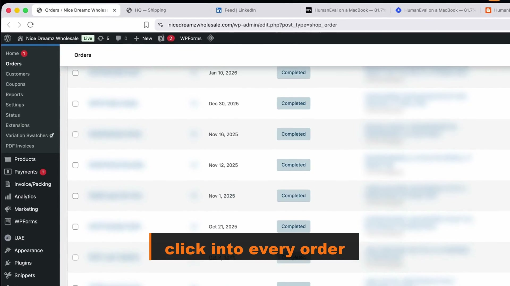

# Cinch

**A shipping dashboard for WooCommerce shops. Built by a shop owner, for shop owners.**

One page. No clicks. Automated.

Cinch pulls every open order from your WooCommerce stores onto one screen with carrier rates already loaded, so you click a rate, the label prints, and the order is marked shipped.

---

## Watch it work

[shipping_dashboard_v5.mp4 — 42 seconds](https://marijuanaunion.com/wp-content/uploads/2026/04/v5.mp4)

The old way, for comparison: click into every order in WP Admin.

## What it is

The shipping dashboard I built for myself after ten years of fighting WordPress.

Every order across every WooCommerce store, on one screen, with rates already loaded from USPS, UPS, and FedEx. Click the rate, the label prints on your thermal printer, the order closes itself. Next order.

In a good run, four seconds per order. Down from a minute and a half.

## What I built

Matt Macosko built Cinch. This repo holds the dashboard front end: [`shipping.html`](shipping.html), one file of HTML, CSS and vanilla JS. The parts in it:

- **Order feed and triage** ([`loadOrders`](shipping.html#L1654)): merges orders, sorts fraud first, then duplicates, then priority.
- **Safe order merging** ([`keyOf`](shipping.html#L1673)): orders merge only when the customer AND the destination address match.
- **Rate picker** ([`pickRecommendedRates`](shipping.html#L1980)): chooses the three likely rates from weight, country and paid shipping method.
- **Label buying and merged-order close-out** ([`shipOrder`](shipping.html#L2080)): one label, then the other merged orders close with the same tracking number.
- **Multi-box flow** ([`getMultiBoxRates`](shipping.html#L1391), [`buyMultiBoxLabels`](shipping.html#L1550)).
- **Pick-bin tags** ([`binsFor`](shipping.html#L642), [`binsForVariation`](shipping.html#L861)).
- **Customer tier pill** ([`renderLoyalty`](shipping.html#L1186)).
- **Thermal print hand-off** ([`printLabel`](shipping.html#L2164)) and **SCAN form** ([`createScanForm`](shipping.html#L2156)).
- **Phone layout** ([`@media` rules](shipping.html#L447)).

Upstream: the WooCommerce REST API, EasyPost (rates, labels, tracking) and Flask. See [CREDITS.md](CREDITS.md).

## What it does

- **Three stores in one list.** Orders from every WooCommerce store you own, merged into a single feed with store badges.
- **Rates pre-loaded.** Open the page, see USPS / UPS / FedEx prices for every order.
- **Same-customer orders auto-merge.** Two orders from the same customer going to the same address collapse into one card. One label. Both close.
- **Fraud watch built in.** Risky orders flag with a red banner and the actual reasons listed inline.
- **Multi-box shipping.** Tell it how many boxes, get rates per box, buy all the labels in one shot.
- **One-tap thermal print.** Direct from dashboard to your label printer. No PDFs, no print dialogs.
- **One row of rates.** The three rates you actually buy show up front, picked from weight, destination and whether the customer paid for priority. The first pick is highlighted. Everything else hides behind one button that opens instantly.
- **Pick locations on the order.** Small metal tags on each line and each variation tell whoever is packing which shelf bin the part lives in, so a new hire can fill an order without knowing the products.
- **Customer history at a glance.** A pill beside the name shows their tier, lifetime spend and a one-line note, so you know who you are packing for.
- **Reads right on a phone.** The header collapses to two columns, rates go two per row, and nothing runs off the screen.
- **End-of-day USPS SCAN form.** One button generates the pickup manifest.

## Known limits

Plain about what is and is not here today:

- **This repo is the front end only.** The Flask backend it calls (`/api/shipping/orders`, `/rates`, `/ship`, `/complete-merged`, `/note`, `/scanform`) is not in this repo yet. You get it by email (see below). Opening `shipping.html` on its own shows no orders.
- **Printing needs a small local print server** listening on `127.0.0.1:9234`. That helper is not in this repo either.
- **Pick-bin rules are written for my own products.** The bin codes in `binsFor` match my shelves. You would rewrite them for yours.
- **Fraud flags, store list and customer history come from the backend.** The page shows them; it does not compute them.

---

## How it works (and what it doesn't do)

I get it — no shop owner wants to load some random Flask app onto a server that touches their live customer orders. So here's exactly what happens, and what doesn't.

**It runs on YOUR server.** You install it on your own VPS (DigitalOcean, Hetzner, Hostinger, whatever you use). Your server, your code, your control. The dashboard code is open source here under MIT; the backend comes to you as source code too.

**Your WooCommerce keys never leave your server.** Cinch reads/writes orders on your shop using API keys you generate in WooCommerce settings. Those keys live in a `.env` file on your VPS. They never get sent anywhere else.

**EasyPost is YOUR account.** You sign up for EasyPost directly. Your shipping rates and labels are billed to your EasyPost account, not mine. I never see your shipments.

**No data ever touches my servers.** I'm not running a SaaS that proxies your orders. There's no central server. Cinch is just code that runs in your shop, on your VPS.

**Nothing to cancel.** It's your code on your VPS. Stop using it any time. Delete it any time. Audit the source any time.

## Why trust this

I'm a real WooCommerce shop owner — Divine Tribe / Nice Dreamz — and I ship hundreds of orders a week through Cinch myself. It's not a side project I'm trying to monetize. It's my daily tool, and I'm sharing it because my partner Melanie watched me use it and said "why aren't you selling that?"

If you've ever lost a ShipStation account because they don't like your industry, or you've watched a cheap shipping SaaS get bought and shut down, or you just want to stop renting tools from people who don't ship anything themselves — Cinch is for you.

## Want it for your shop?

Two ways:

**1. Self-install** (recommended).
Email **info@nicedreamzwholesale.com** and I'll send you the full backend code + setup guide. You install it yourself. I'll hop on a screen-share and walk you through the tricky parts if you want — but you're the only one with credentials. When the call ends, you're running it solo.

What you will need: a VPS, WooCommerce REST API keys for each store, an EasyPost account, and a thermal label printer on the packing computer.

**2. I'll install it for you.**
If you'd rather not deal with VPS setup, I'll spin up a clean Hetzner box, install Cinch, configure it for your shop, hand you SSH keys and a login URL, and step away. You own the box. You own the data. I leave.

If enough shop owners want this, I'll build a hosted version where setup is one click. But for now: self-hosted, your keys, your data.

## Tech stack

Flask · WooCommerce REST · EasyPost API · vanilla JS frontend · runs on a small VPS (1 vCPU / 1 GB RAM is plenty).

## License

MIT — see [LICENSE](LICENSE).

— Matt
