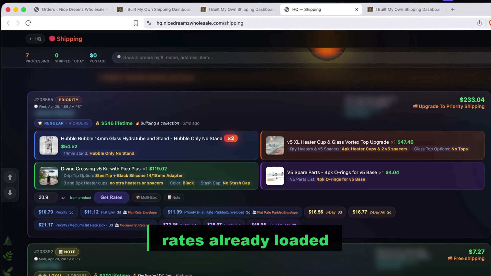

# Manifest

**A shipping dashboard for WooCommerce shops.**

One page. No clicks. Automated.

---

## What it is

The shipping dashboard I built for myself after ten years of fighting WordPress.

Every order across every WooCommerce store, on one screen, with rates already loaded from USPS, UPS, and FedEx. Click the cheapest rate, the label prints on your thermal printer, the order closes itself. Next order.

In a good run, four seconds per order. Down from a minute and a half.

## Watch it work

[shipping_dashboard_v5.mp4 — 42 seconds](https://marijuanaunion.com/wp-content/uploads/2026/04/v5.mp4)

## What it does

- **Three stores in one list.** Orders from every WooCommerce store you own, merged into a single feed with store badges.
- **Rates pre-loaded.** Open the page, see USPS / UPS / FedEx prices side by side for every order. Cheapest is highlighted.
- **Same-customer orders auto-merge.** Two orders from the same email collapse into one card. One label. Both close.
- **Fraud watch built in.** Risky orders flag with a red banner and the actual reasons listed inline.
- **Multi-box shipping.** Tell it how many boxes, get rates per box, buy all the labels in one shot.
- **One-tap thermal print.** Direct from dashboard to your label printer. No PDFs, no print dialogs.
- **End-of-day USPS SCAN form.** One button generates the pickup manifest.

## Want it for your shop?

Right now this runs on my own VPS for my own three stores. To install it for someone else takes a weekend — swapping in your WooCommerce keys, your EasyPost account, your from-address, and putting it behind a login that's just yours.

If you run a WooCommerce shop and want to try it — especially if you're in hemp, CBD, or cannabis where ShipStation has given you grief — email **info@nicedreamzwholesale.com**.

If enough people want it, I'll turn it into a product anyone can sign up for.

## Tech stack

Flask · WooCommerce REST · EasyPost · vanilla JS frontend · runs on a small VPS.

## License

MIT — see [LICENSE](LICENSE).

— Matt
